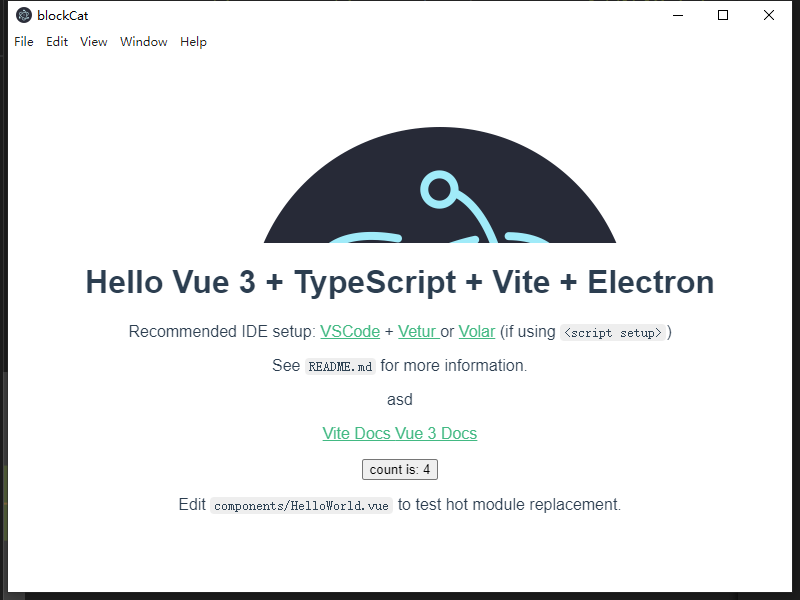

<!-- # Vue 3 + Typescript + Vite

This template should help get you started developing with Vue 3 and Typescript in Vite.

## Recommended IDE Setup

[VSCode](https://code.visualstudio.com/) + [Vetur](https://marketplace.visualstudio.com/items?itemName=octref.vetur). Make sure to enable `vetur.experimental.templateInterpolationService` in settings!

### If Using `<script setup>`

[`<script setup>`](https://github.com/vuejs/rfcs/pull/227) is a feature that is currently in RFC stage. To get proper IDE support for the syntax, use [Volar](https://marketplace.visualstudio.com/items?itemName=johnsoncodehk.volar) instead of Vetur (and disable Vetur).

## Type Support For `.vue` Imports in TS

Since TypeScript cannot handle type information for `.vue` imports, they are shimmed to be a generic Vue component type by default. In most cases this is fine if you don't really care about component prop types outside of templates. However, if you wish to get actual prop types in `.vue` imports (for example to get props validation when using manual `h(...)` calls), you can use the following:

### If Using Volar

Run `Volar: Switch TS Plugin on/off` from VSCode command palette.

### If Using Vetur

1. Install and add `@vuedx/typescript-plugin-vue` to the [plugins section](https://www.typescriptlang.org/tsconfig#plugins) in `tsconfig.json`
2. Delete `src/shims-vue.d.ts` as it is no longer needed to provide module info to Typescript
3. Open `src/main.ts` in VSCode
4. Open the VSCode command palette
5. Search and run "Select TypeScript version" -> "Use workspace version" -->

# 合成构建 electron Vue3
> 免责声明

本项目是基于 Vue3.0、Typescript 、Vite 、 node 集成在Electron12.x版本的程序开发。
本项目只是对electron和vue这些没有太多了解的进行的包装， 大佬请绕行 参考文献已经忘了 

## 项目启动流程
 - yarn  下载依赖
 - yarn dev:all 启动程序 
 - yarn build:all 打包程序

 - `当然如果您需要单独启动node服务和vue单页面应用 不妨去pacheage.json里面看看哟 `

 附带一下[**我**](www.sparrowend.com)的blog
 

### PS
此版本没有做程序自动更新，也没有做其他的一些琐碎事情， 只是简单基本几大JS库搭建的便捷应用程序包。 
额... 由于时间此版本搭建时间至此过长， 我已经忘记是否基于node做中间层了， 但是如果需要的话， 简单的在主进程里面fork一个子进程就可以了， 或者直接通过require的方式引用，但是有进程杀死与否的弊端， 斟酌处理就好。

有需要请扫码: 

